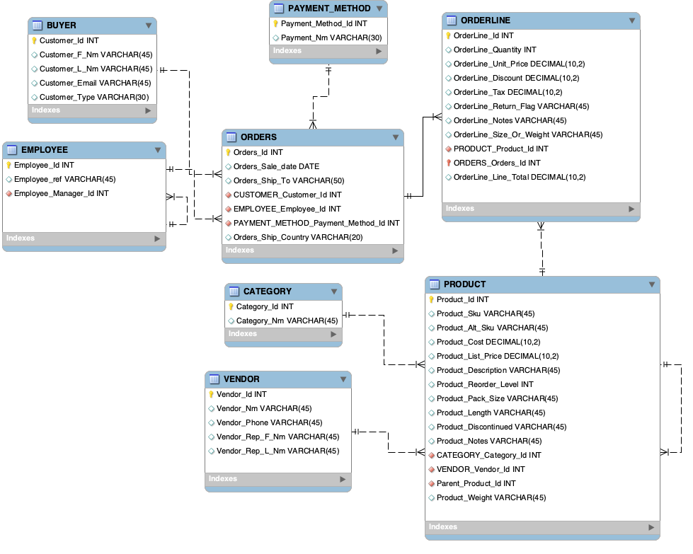

# Northline Outfitters — Retail Data Cleanup, Modeling, and SQL

**MIST 4610 | Group Project 2**
University of Georgia — Terry College of Business | Spring 2026

---

## Table of Contents

1. [Project Overview](#project-overview)
2. [Team Members](#team-members)
3. [Data Model](#data-model)
4. [Data Model Description](#data-model-description)
5. [Data Quality Assessment](#data-quality-assessment)
6. [Data Cleaning Process](#data-cleaning-process)
7. [Queries](#queries)

---

## Project Overview

Northline Outfitters is a small online retail company that sells student-friendly lifestyle and tech accessories — including hoodies, water bottles, desk lamps, phone cases, keyboards, mouse pads, and backpacks — to customers in the United States and Canada. The company purchases merchandise from external vendors and sells directly to consumers.

Because the business is still growing, its records are maintained in Excel spreadsheets rather than a proper relational database. We were provided two exports from the company's operations:

- `Sales_Dump` — order line-level transaction data
- `Product_Supplier_Master` — product catalog and vendor information

Both files were intentionally dirty, partially duplicated, and unnormalized. Issues ranged from mixed date formats and inconsistent country codes to blended customer name fields and messy discount and tax representations. Our task was to assess those issues, clean the data, design and implement a normalized relational database, import the cleaned data, and write meaningful SQL queries against it.

---

## Team Members

| Name |
|------|
| Haylesh Fernandez |
| Zain Naseer |
| Italia Roman |
| Alden Majors |

---

## Data Model



---

## Data Model Description

### Buyers & Orders
All customers who place orders with Northline are stored in the `BUYER` table, which holds first name, last name, email, and customer type (Student, Loyalty, Guest, or Standard). Each buyer can be associated with many orders, but each order belongs to exactly one buyer.

### Employees & Manager Hierarchy
The `EMPLOYEE` table tracks all staff who process orders. It includes a recursive self-referencing relationship through `Employee_Manager_Id`, meaning each employee can report to a manager who is also stored in the same table. This captures Northline's internal hierarchy without needing a separate manager entity.

### Payment Methods
`PAYMENT_METHOD` is a lookup entity that stores payment types such as Visa, Mastercard, Debit, and Apple Pay. One payment method can be associated with many orders.

### Orders & Order Lines
`ORDERS` is the central transaction entity linking a buyer, an employee, and a payment method together. Each order has a sale date, a ship-to destination, and a ship country, and can contain multiple line items. `ORDERLINE` represents each individual line item on an order, storing quantity, unit price, discount, tax, return flag, size/weight, notes, and the calculated line total. Each line is tied to one order and one product.

### Products, Categories & Variants
`PRODUCT` contains the full product catalog including SKU, alternate SKU, description, cost, list price, reorder level, pack size, dimensions, discontinued status, and notes. Each product belongs to one category and one vendor. Products also have a self-referencing `Parent_Product_Id` to represent variants such as Mini or Student Edition versions of a base product. `CATEGORY` is a lookup entity for the seven product categories used by Northline: Tech, Apparel, Audio, School, Accessories, Lifestyle, and Desk Setup.

### Vendors
`VENDOR` stores supplier information including vendor name, phone number, and the rep's first and last name. One vendor can supply many products.

---

## Data Quality Assessment

Both source files contained significant quality issues across formatting, structure, and completeness. The main problems identified in each file are listed below.

### Sales_Dump Issues

| Issue | Description |
|-------|-------------|
| Mixed date formats | `sale_date` appeared in 6+ formats including `Oct 17 25`, `10-11-2025`, and `31/10/2025`. Canadian orders (CORD- prefix) used DD-MM-YYYY while US orders used MM-DD-YYYY, causing ambiguous parses. |
| Inconsistent `ship_country` | Values included `US`, `USA`, `Canada`, `CA`, and 3 null rows. |
| Mixed payment method casing | Values like `visa`, `VISA`, and `MC` referred to the same payment type. |
| Mixed discount formats | Discounts appeared as `10%`, `5`, `promo5`, and `student 10%` across different rows. |
| Mixed tax formats | Tax appeared as `13%`, `0.13`, `HST 13%`, and `8.25%`. 33 rows were legitimately null. |
| Currency prefixes in price fields | `unit_price` and `line_total` had `USD`/`CAD` prefixes and `$` signs mixed with bare numbers. |
| Text embedded in quantity | 32 rows had values like `"2 units"` instead of a plain integer. |
| Blended `customer_info` field | A single field combined first name, last name, and customer type flags (Student, Loyalty, Guest) with inconsistent delimiters (`;`, `|`, `/`). |
| Category variants | Values like `"Tech / Student"` mixed product category with customer type in the same field. |
| Inconsistent `size_or_weight` units | Weight values in oz, g, kg, and lb were mixed with length values in inches and cm, with no unit indicator column. |
| ALL CAPS product descriptions | 11 SKUs had descriptions entered in all caps (e.g., `CAMPUS HOODIE`, `BREEZE RING LIGHT`). |
| Malformed customer emails | 3 emails had typos: `@school.ed`, `@school`, and `@example.caa`. |
| Null customer emails | 50 rows were missing an email address before cleaning. |
| Null return flags | 40 rows had no value in the `return_flag` field. |

### Product_Supplier_Master Issues

| Issue | Description |
|-------|-------------|
| Category inconsistency | 20+ variant strings like `"Tech & Student"` and `"Apparel / Student"` required normalization to the 7 canonical categories. |
| Currency prefixes in cost/price | Values like `USD 6.25` were mixed with bare numerics like `31.4`. |
| Mixed weight units | 5+ unit formats: ounces, grams, kg, lbs, and "pound". |
| Mixed length units | 4+ formats: in, cm, `"` notation, and "centimetres". |
| Exact duplicate rows | Some SKUs appeared up to 3 times with fully identical data. |
| `pack_size` inconsistency | One row had an integer `1` instead of the `"1 each"` text used everywhere else. |
| Null `alt_sku`, `reorder_level`, `pack_size`, `weight_g`, `length_cm` | Multiple fields were null where a consistent value could be inferred from sibling rows sharing the same SKU. |
| `reorder_level` stored as text | 4 rows had the value `"ten"` instead of the integer `10`. |
| Null `parent_sku` on variant rows | 41 variant rows (Mini, Student Edition, color/size variants) were missing a `parent_sku` value. |
| Vendor name typo | `"Urban Sources"` vs. `"Urban Source"` — confirmed to be the same vendor by matching phone number. |
| Vendor phone format inconsistency | Formats mixed `XXX-XXX-XXXX`, `XXX.XXX.XXXX`, and `(XXX)XXX-XXXX`. |
| Vendor rep contact noise | Some rep entries included appended `"/ email missing"` notes or had typos (e.g., `"Mia Dia zFernandez"`). |

---

## Data Cleaning Process

All cleaning was performed using SQL in MySQL Workbench after importing the raw data. The cleaned outputs are saved in `MIST4610-Cleaned-Data.xlsx` as `Sales_Dump_Cleaned` and `Product_Supplier_Cleaned`. A full audit trail of every change made is documented in the `Cleaning_Log` and `Deterministic_Fill_Log` sheets within the same file.

### Sales_Dump Cleaning

**Dates** — All date values were standardized using SQL after import. Canadian orders (identified by the `CORD-` prefix in `order_id`) were treated with DD-MM-YYYY convention; US orders used MM-DD-YYYY. Four specific rows required manual correction after cross-referencing other lines within the same `order_id`:
- LN-019: `09-10-2025` → `2025-10-09`
- LN-042: `09-11-2025` → `2025-11-09`
- LN-105: `08/10/2025` → `2025-10-08`
- LN-118: `04-11-2025` → `2025-11-04`

All dates standardized to ISO `YYYY-MM-DD`.

**Country** — Normalized all `ship_country` values to `US` or `CA`. The 3 null rows were filled using the `order_id` prefix (`CORD` = Canada, `UORD` = US), a pattern that held consistently across all 200 rows.

**Payment Method** — Title-cased all values. Mapped `MC` → `Mastercard`.

**Discounts** — Converted all formats to decimal rates: `10%` → `0.10`, `5` → `0.05`, `promo5` → `0.05`, `student 10%` → `0.10`. Text-labeled values were cleaned using SQL string functions to extract the numeric portion.

**Tax** — Stripped `%` signs and text labels; converted all to decimal rates (`13%` → `0.13`, `8.25%` → `0.0825`). 12 null rows were filled using the unique non-null tax rate present on another line within the same `order_id`. 33 remaining nulls were left as-is.

**Prices / Line Totals** — Stripped all `$`, `USD`, and `CAD` prefixes; stored as numeric. `line_total` was left null where missing as it does not consistently reconcile to a single formula.

**Quantity** — Extracted the numeric portion from values like `"2 units"` using SQL string functions. Stored as integer.

**Customer Info** — Split the blended `customer_info` field into `customer_f_nm`, `customer_l_nm`, and `customer_type` using SQL string functions. The type was identified from embedded keywords (Student, Loyalty, Guest); rows without a keyword were defaulted to `Standard`. Multiple delimiters (`;`, `|`, `/`) were all handled.

**Category** — Extracted the primary category before any `/` or `&` delimiter. Normalized to 7 canonical categories: Tech, Apparel, Audio, School, Accessories, Lifestyle, Desk Setup.

**Size/Weight** — Standardized using SQL by detecting the unit type in each value: weight values (oz, g, kg, lb) were converted to grams; length values (in, `"`, cm) were converted to cm. `"one size"` was preserved as a text value.

**Product Descriptions** — 11 ALL CAPS descriptions were normalized to title case using the `Product_Supplier_Master` as the canonical reference per SKU. An additional 14 rows that had been mapped to wrong variants were corrected by matching the original ALL CAPS value against the product table.

**Emails** — Fixed 3 malformed emails using SQL UPDATE statements. Filled 24 of the 50 null emails by matching on the `(customer_f_nm, customer_l_nm, customer_type, ship_country)` composite key — applied only where that key mapped to exactly one unique email across the dataset. 26 nulls remained unfillable and were left as-is.

**Return Flag** — 40 null rows filled with `"N"`. All 40 had no return-related notes, supporting the assumption that the absence of a flag means no return was recorded.

### Product_Supplier_Master Cleaning

**Category** — Mapped 20+ variant strings to the same 7 canonical categories used in the sales data.

**Cost / List Price** — Stripped `USD`/`CAD` prefixes; stored as numeric.

**Weight** — Converted all weight values to grams; column renamed `weight_g`.

**Length** — Converted all length values to cm; column renamed `length_cm`.

**Exact Duplicates** — Removed fully identical duplicate rows. Variant rows sharing a SKU but differing in description were retained; the `parent_sku` field tracks their relationship to the base product.

**Null Fields** — Filled `alt_sku`, `reorder_level`, `pack_size`, `weight_g`, and `length_cm` where a consistent non-null value existed across all other rows with the same SKU. Full cell-level detail is logged in the `Deterministic_Fill_Log` sheet.

**Reorder Level** — Converted 4 text values of `"ten"` to the integer `10`. Two rows (ClickStorm Gaming Mouse Mini and TrailSip Bottle) had been incorrectly filled with a sibling-row value and were corrected to `10`.

**Parent SKU** — Filled `parent_sku` for 41 variant rows (Mini, Student Edition, color/size variants) that were missing this value. Set to the base product's SKU consistent with the pattern used throughout the source file.

**Vendor Name** — Corrected `"Urban Sources"` → `"Urban Source"` in 2 rows. Confirmed by matching phone number and majority form (14 rows vs. 2).

**Vendor Phone** — Normalized all formats to `XXX-XXX-XXXX`.

**Vendor Rep** — Stripped `"/ email missing"` noise from rep name fields. Corrected typo `"Mia Dia zFernandez"` → `"Mia Diaz"`. Split into `Vendor_Rep_F_Nm` and `Vendor_Rep_L_Nm` to match the updated data model.

**Pack Size** — Replaced the integer `1` with `"1 each"` for consistency with all other rows.

### SQL Used for Post-Import Standardization

```sql
-- Normalize ship_country after import
UPDATE ORDERS
SET Orders_Ship_Country = 'US'
WHERE Orders_Ship_Country IN ('USA', 'United States');

UPDATE ORDERS
SET Orders_Ship_Country = 'CA'
WHERE Orders_Ship_Country IN ('Canada', 'CAN');

-- Normalize payment method names
UPDATE PAYMENT_METHOD
SET Payment_Nm = 'Mastercard'
WHERE Payment_Nm IN ('MC', 'mastercard', 'MASTERCARD');

UPDATE PAYMENT_METHOD
SET Payment_Nm = CONCAT(UPPER(LEFT(Payment_Nm, 1)), LOWER(SUBSTRING(Payment_Nm, 2)));

-- Set null return flags to 'N'
UPDATE ORDERLINE
SET OrderLine_Return_Flag = 'N'
WHERE OrderLine_Return_Flag IS NULL;

-- Normalize discontinued flag nulls
UPDATE PRODUCT
SET Product_Discontinued = 'N'
WHERE Product_Discontinued IS NULL OR Product_Discontinued = '';

-- Strip currency prefix from cost if imported as string
UPDATE PRODUCT
SET Product_Cost = CAST(REPLACE(REPLACE(Product_Cost, 'USD ', ''), 'CAD ', '') AS DECIMAL(10,2))
WHERE Product_Cost REGEXP '^[A-Z]';
```

---

## Queries

### Required Query 1 — Highest Total Sales Revenue by Country

Query 1 lists the ship country, product description, and total revenue for all products, grouped by country and ordered by total revenue in descending order.

```sql
SELECT ORDERS.Orders_Ship_Country,
       ORDERLINE.product_description,
       FORMAT(SUM(ORDERLINE.OrderLine_Quantity * ORDERLINE.OrderLine_Unit_Price * (1 - ORDERLINE.OrderLine_Discount)), 2) AS Total_Revenue
FROM ORDERLINE, ORDERS
WHERE ORDERLINE.ORDERS_Orders_Id = ORDERS.Orders_Id
GROUP BY ORDERS.Orders_Ship_Country, ORDERLINE.product_description
ORDER BY ORDERS.Orders_Ship_Country, SUM(ORDERLINE.OrderLine_Quantity * ORDERLINE.OrderLine_Unit_Price * (1 - ORDERLINE.OrderLine_Discount)) DESC;
```

> 📷 _Add your MySQL Workbench screenshot here — replace this line with:_ ``


Query 1 allows Northline managers to identify which products are driving the most revenue in each market. Since the company sells to both the US and Canada, understanding regional performance helps the business prioritize inventory, marketing efforts, and vendor reorders based on where each product is actually selling.

---

### Required Query 2 — Employee Order Counts Compared to Manager Peers

Query 2 lists the manager reference, employee reference, and total number of distinct orders handled for each employee, grouped by manager and ordered by order count in descending order.

```sql
SELECT mgr.Employee_ref AS Manager_Ref,
       emp.Employee_ref AS Employee_Ref,
       COUNT(DISTINCT ORDERS.Orders_Id) AS Orders_Handled
FROM EMPLOYEE emp, EMPLOYEE mgr, ORDERS
WHERE emp.Employee_Manager_Id = mgr.Employee_Id
AND ORDERS.EMPLOYEE_Employee_Id = emp.Employee_Id
GROUP BY mgr.Employee_ref, emp.Employee_ref
ORDER BY mgr.Employee_ref, Orders_Handled DESC;
```

> 📷 _Add your MySQL Workbench screenshot here — replace this line with:_ ``


Query 2 allows Northline managers to see how each employee's order volume stacks up against coworkers who report to the same manager. This helps identify top performers and flag employees who may need additional support or coaching, while giving managers a fair peer comparison within their own teams.

---

### Required Query 3 — Vendors Supplying More Than One Category

Query 3 lists each vendor name, the number of distinct categories they supply, and the category names for all vendors whose products span more than one category.

```sql
SELECT VENDOR.Vendor_Nm,
       COUNT(DISTINCT CATEGORY.Category_Id) AS Num_Categories,
       GROUP_CONCAT(DISTINCT CATEGORY.Category_Nm ORDER BY CATEGORY.Category_Nm SEPARATOR ', ') AS Categories
FROM VENDOR, PRODUCT, CATEGORY
WHERE PRODUCT.VENDOR_Vendor_Id = VENDOR.Vendor_Id
AND PRODUCT.CATEGORY_Category_Id = CATEGORY.Category_Id
GROUP BY VENDOR.Vendor_Nm
HAVING COUNT(DISTINCT CATEGORY.Category_Id) > 1
ORDER BY Num_Categories DESC;
```

> 📷 _Add your MySQL Workbench screenshot here — replace this line with:_ ``


Query 3 allows Northline managers to identify which vendors are supplying products across multiple categories. These vendors represent key strategic relationships for the business and could be prioritized for volume negotiations or consolidated purchasing agreements.

---

### Additional Query 1 — Return Rate by Product Category

Query 1 lists each product category and the number of order lines that were returned, using a CASE statement to count returns. Results are ordered from highest to lowest return count.

```sql
SELECT CATEGORY.Category_Nm,
       COUNT(CASE WHEN ORDERLINE.OrderLine_Return_Flag = 'Y' THEN 1 END) AS Returned_Lines
FROM ORDERLINE, PRODUCT, CATEGORY
WHERE ORDERLINE.PRODUCT_Product_Id = PRODUCT.Product_Id
AND PRODUCT.CATEGORY_Category_Id = CATEGORY.Category_Id
GROUP BY CATEGORY.Category_Nm
ORDER BY Returned_Lines DESC;
```


Query 1 allows Northline managers to see which product categories are being returned the most. This helps identify potential quality or fulfillment issues so managers know where to focus their attention.

---

### Additional Query 2 — Average Discount by Customer Type

Query 2 lists each customer type along with the average discount rate applied to their orders. The IF() function labels each group as "Discounted" if the average discount is greater than zero, or "No Discount" otherwise.

```sql
SELECT BUYER.Customer_Type,
       FORMAT(AVG(ORDERLINE.OrderLine_Discount), 2) AS Avg_Discount_Rate,
       IF(AVG(ORDERLINE.OrderLine_Discount) > 0, 'Discounted', 'No Discount') AS Discount_Status
FROM ORDERLINE, ORDERS, BUYER
WHERE ORDERLINE.ORDERS_Orders_Id = ORDERS.Orders_Id
AND ORDERS.CUSTOMER_Customer_Id = BUYER.Customer_Id
GROUP BY BUYER.Customer_Type
ORDER BY Avg_Discount_Rate DESC;
```


Query 2 allows Northline managers to see which customer types are receiving the highest average discounts. This helps ensure discount policies are being applied fairly and consistently across all customer segments.

---

### Additional Query 3 — Product Cost vs Price Label

Query 3 lists each product's name, cost, and list price, and uses a CASE statement to label it as "High Margin", "Medium Margin", or "Low Margin" based on how much profit it generates per unit.

```sql
SELECT PRODUCT.Product_Description,
       FORMAT(PRODUCT.Product_Cost, 2) AS Cost,
       FORMAT(PRODUCT.Product_List_Price, 2) AS List_Price,
       CASE
           WHEN PRODUCT.Product_List_Price - PRODUCT.Product_Cost >= 40 THEN 'High Margin'
           WHEN PRODUCT.Product_List_Price - PRODUCT.Product_Cost >= 20 THEN 'Medium Margin'
           ELSE 'Low Margin'
       END AS Margin_Label
FROM PRODUCT
WHERE PRODUCT.Parent_Product_Id IS NULL
ORDER BY PRODUCT.Product_List_Price - PRODUCT.Product_Cost DESC;
```


Query 3 allows Northline managers to quickly see which products are the most profitable per unit. Knowing this helps the business decide what to promote and prioritize when placing orders with vendors.
